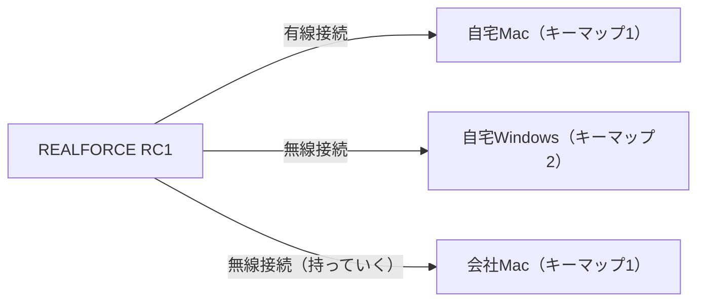

商品はコレ。

https://www.realforce.co.jp/products/C1HK13/

- US配列
- 荷重30g
- ブラック・グレー（白ではない）

FILCO => HHKB => REALFORCE テンキーレスときていまが REALFORCE RC1。これまで、在宅勤務用、在宅PCゲーム用、会社用で3つ（！）の REALFORCE テンキーレスキーボードを使っていたけど、RC1 がうまくハマって1台にまとめられそうなので記念カキコ。

## キーボードに求めるもの
›
僕の生活から、キーボードに求められる要件が以下のとおり:

1. US配列
1. MacBook Pro とまったく同じとはいかないまでもできるだけ近いキー配列
1. PCゲーム用のWindowsでも使う
1. 自宅でも会社でもキーボードを使う
1. 有線・無線はどちらでもOK

### US配列

こっちで慣れてしまった。プログラミング用のソフトウェアやツールなどのキーボードショートカットが、「US配列前提で作られていることが多いな」と感じて感じてUS配列にしたのがきっかけ。戻る・進むのショートカットが `Cmd+[`, `Cmd+]` だったりね。JIS配列だと上下だけどUS配列だと左右に並んでて直感的に操作しやすいことが多い。

### MacBook Pro とまったく同じとはいかないまでもできるだけ近いキー配列

会議室だろうがどこだろうか絶対に毎キーボードを持ち運ばないとなにもできません
…という状態は避けたかった。HHKBをやめた理由がコレ。普通に切り替えて使える人もいるらしく、羨ましいとおもった。

REALFORCE RC1 はFunctionキーがついている点が嬉しいポイント。だいぶMacBook Proとの差分が縮まる。
ただし、REALFORCE RC1 のキー配列について、右シフトあたりがけっこう無理矢理感があり、正直この部分で使い続けるかどうかかなり悩んだ。しばらく使い続けて、これくらいのズレならば MacBook Pro キーボードと行き来してもそんなにストレスはないな、ということで使い続けることにした。こればかりは使ってみないとわからないですね。

### PCゲームのWindowsで使う

ゲームパッドでやるにしても、ログイン時にPINコードいれる操作はどうしても必要になる。REALFORCE RC1 がうまいことハマったのはこれがでかいかもしれない。

US配列はWindowsで日本語入力モードをどう切り替えるかが課題だった。REALFORCE RC1 の場合は **キーボード側にキーマップを保存できるため、Windows用のキーマップでFn+Altで日本語、Fn+Ctrlで英数字とした。** コレ便利っす。なおかつ、保存したキーマップはFn+F1〜F4ですぐさま切り替えられる。

*Fnを押したときにAltとCtrlでそれぞれ言語を変更できるようにした*

接続先の切り替えも課題だった。ふたつキーボードをもっていたが、かさばるし…。REALFORCE RC1 の場合はBluetoothペアリングした機器を4台までFn+1〜4ですぐさま切り替えられる。有線接続を含めると5台までイケる。

なので、Macで仕事して、夜、ゲームしたいなってときは、Fn+2でWindowsにBluetooth接続して、Fn+F2でWindows用のキーマップに切り替えるというワケ。これですぐにWindows機を利用できる。たいへんありがたい。FPSとかやるときは有線接続すればいいしね。

### 自宅でも会社でもキーボードを使う

自宅でも会社でも同じMacなわけだけど、出社してコードをつなぎまくるのって地味に面倒。ということで会社ではMacにBluetoothで接続している。

### 有線・無線はどちらでもOK

とくにこだわりはなかったけど、**どちらでもつなげられる**というのが結果的にやりたいようにできてありがたかった。

## REALFORCE RC1 のありがたい機能

あらためて機能側から嬉しいところを列挙する。

- キーマップを本体に保存できる: どれかの端末でキーマップを設定すれば、他の端末では専用のソフトウェアなどは不要
- キーマップをすぐに切り替えられる
- Bluetooth4台+有線接続1台接続できる
- 接続先をすぐに切り替えられる
- コンパクトサイズ（ギリギリ持ち運びできるレベル）

このサイズで物理Functionキーがあり、本体側にキーマップを保存できるキーボードってあんまりないと思うので、日本のメーカーから出してくれたのは大変助かります。

## REALFORCE RC1 のためらいポイント

- 右シフトまわりの無理矢理感が許せるかどうか
- ZXCVの並びのズレが許せるかどうか
- 3万5千円という値段が許せるかどうか

良いキーボードです。