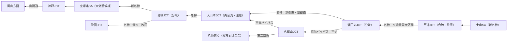

墨田区から北九州小倉へ、復路は岐阜各務原を経由してクルマで帰省した記録。走行距離2281.9km, 平均燃費16km

## 往路1（堤通IC〜八幡東IC）

- 2:30 起床
- 3:00 墨田区を出発、堤通ICを通過
- 8:00頃 土山SAで休憩
- 10:40頃 枚方の温泉施設に到着
- 15:00 ファミリーロッジ枚方に到着

給油：満タン

渋滞した箇所：なし

## 往路2（久御山淀IC〜富野IC）

- 5:00 起床
- 5:30 出発、久御山淀ICを通過
- 9:44 宮島SAに到着
- 11:45 宮島SAを出発
- 14:30 富野ICに到着

渋滞した箇所：なし

給油：満タン

## 復路1（富野IC〜岐阜各務原IC）

- 2:30 起床
- 3:15 出発、富野ICを通過
- 8:37頃 宝塚北SAに到着
- 給油: 1000円分
- 10:30 宝塚北SAを出発
- 13:34頃 岐阜各務原ICに到着

渋滞した箇所：宝塚北SAから大津までの名神高速道路

## 復路2（美濃加茂IC〜向島IC）

- 4:30 起床
- 5:21 出発
- 5:31頃 坂祝バイパス 鵜沼ICを通過
- 5:44頃 美濃加茂ICを通過
- 8:40 海老名SAに到着
- 11:00 海老名SAを出発
- 12:00 自宅に到着

渋滞した箇所：なし

## ふりかえり

### うまくいった点

深夜・早朝出発の戦略がよく機能した形。有名な渋滞区間と実績は以下のとおり。
- 海老名〜御殿場（下り）回避できた
- 広島あたりの山陽道（下り）回避できた
- 名神・京滋バイパス（上り）回避できず
- 御殿場〜海老名（上り）回避できた

3:00・5:30・3:15・5:21 という4回の出発はいずれも渋滞帯より前に混雑区間を抜けられていて、お盆期間でも成立することを確認。復路2は象徴的で、Uターンラッシュ当日の日曜に美濃加茂→海老名を約3時間・ほぼノンストップで走り抜けて正午に帰宅できたのは、この時期としては理想に近い結果だったと思う。

もうひとつは「長距離走行＋休憩」のリズムが確立できたこと。家族も3時間ならなんとか起きている間に移動できる。それ以上は厳しそう。自分も5時間運転（こまめに休憩をとりつつ）+1時間ほど休憩+3時間運転 なら稼働できることがわかった。

### 往路1はもっと行けたかも

次回、変えるとしたら往路1。走行が10:40で終わっていて実質7時間半しか使っておらず、その結果、往路2が枚方→小倉の約600km・9時間と、4日間で最も重い日になってしまった。倉敷あたりまで伸ばしていれば配分は約500km:350kmになり、2日目がかなり楽になったかも。初日は疲労の見積もりが立たなかったため滞在を枚方にしておいた、というのもある。枚方ではなく岡山あたりまで行けるといいかな。

### どこまで西にいくか？

下り方向のトポロジーはこう。

- できれば早朝のうちにこのあたりの交通集中区間を抜けたい
- 往路1で泊まった枚方は、淀川を挟んで大山崎JCTのすぐ南。つまり瀬田・宇治側の難所は通過済みで、翌朝は京滋バイパス経由でも第二京阪経由でも選べる、結果的に良い位置取りだったといえる

### 次回：休憩を宝塚北SAまで送るか？

岡山まで狙うなら、休憩は土山SAではなくもう少し先に送る。土山で長く休むと、その後の草津合流〜大山崎〜高槻を、交通量が立ち上がった時間帯に通ることになる。

- 3:00 出発 → 8:00頃 土山SA（トイレだけの小休止）
- そのまま京滋バイパス → 大山崎 → 高槻JCT → 新名神と進み、9:15〜9:30頃 **宝塚北SAで休憩**
- 10:30頃 再出発。宝塚北から岡山ICは約180km・約2時間なので、12:30〜13:00頃に岡山着
- 岡山で入浴して、15〜16時に倉敷周辺の宿

6時間オーバーはなかなか運転きつそう…。
